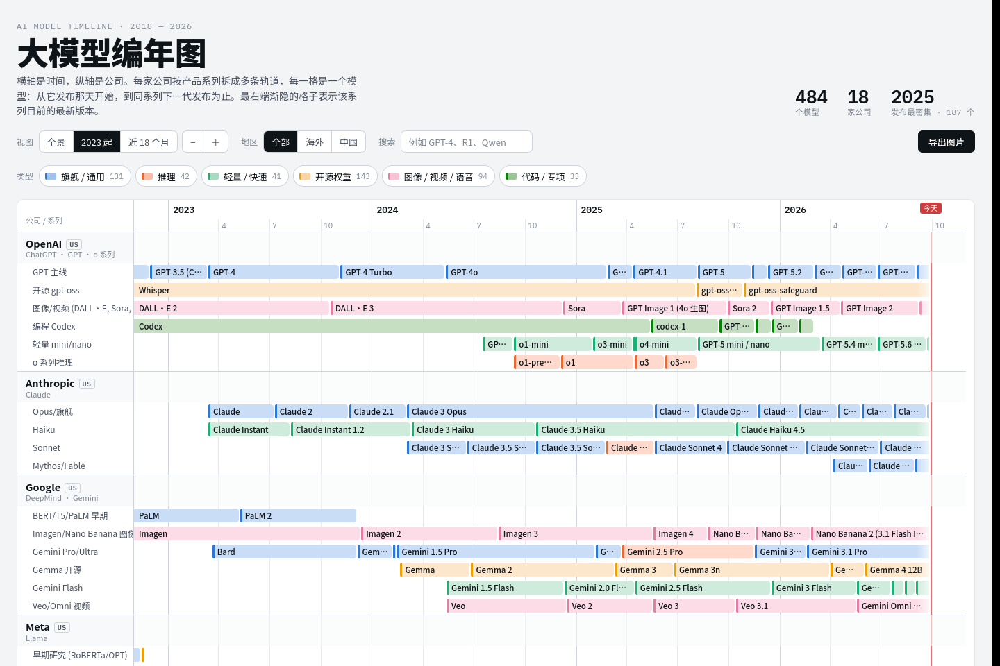

# 大模型编年图

一张可交互的 AI 大模型发布时间线：横轴是时间（2018 年至今），纵轴是 18 家公司。每家公司按产品系列拆成多条轨道，每个色块是一个模型，从发布那天开始，到同系列下一代发布为止。

- 缩放（按钮或 Ctrl + 滚轮），三个预设视图：全景 / 2023 起 / 近 18 个月
- 按地区（海外 / 中国）、模型类型、关键词筛选
- 悬停查看发布日期、接替者、在位天数和备注
- 导出完整大图（PNG 或 SVG），导出时沿用当前的筛选条件
- 底部有全部模型的表格视图
- 支持浅色 / 深色主题和手机屏幕

在线查看：**https://wenhaoquestion.github.io/AI-Model-Timeline/**

<a href="https://wenhaoquestion.github.io/AI-Model-Timeline/">
  <picture>
    <source media="(prefers-color-scheme: dark)" srcset="docs/screenshot-dark.png">
    
  </picture>
</a>

## 使用

直接用浏览器打开 `dist/index.html` 即可，不需要服务器。页面只从 Google Fonts 加载字体，离线时会退回系统字体。

## 部署

推送到 `main` 分支后，GitHub Actions（`.github/workflows/pages.yml`）会运行 `build.py` 校验数据、生成页面，并发布到 GitHub Pages。数据有错误时构建会失败，线上页面保持上一个版本。所以在 GitHub 网页上直接改 `data/*.json` 也能自动更新网站。

## 目录结构

```
ai-model-timeline/
├── build.py            # 校验数据并生成 dist/index.html
├── site.json           # 数据截至日期 asOf
├── src/template.html   # 页面模板（样式、交互、导出逻辑）
├── data/
│   ├── companies.json  # 公司列表，顺序即页面上的行顺序
│   ├── openai.json     # 每家公司一个文件，文件名 = companies.json 里的 key
│   └── ...
└── dist/index.html     # 生成的单文件页面
```

## 修改数据

每个公司文件是一个数组，每条记录一个模型：

```json
{"lane": "GPT 主线", "m": "GPT-4o", "d": "2024-05-13", "t": "flagship", "n": "原生多模态"}
```

| 字段 | 含义 |
|---|---|
| `lane` | 所属系列（同一系列的模型画在同一条轨道上，前后相接） |
| `m` | 模型名 |
| `d` | 发布日期 `YYYY-MM-DD`（也可以只写 `YYYY-MM`） |
| `t` | 类型：`flagship` 旗舰 / `reasoning` 推理 / `small` 轻量 / `open` 开源权重 / `media` 图像视频语音 / `code` 代码专项 |
| `n` | 备注，建议 25 字以内 |
| `end` | 可选。模型停更且同系列没有下一代时填写停更日期，否则色块会一直延伸到"今天" |

色块的结束时间由同一 `lane` 里下一个模型的发布日期自动决定，不需要手动填写。

新增公司：在 `data/companies.json` 里加一行（`key`、`name`、`sub`、`region`、`china`），再新建 `data/<key>.json`。

改完后运行：

```bash
python3 build.py            # 校验并生成 dist/index.html
python3 build.py --check    # 只校验
```

更新数据后记得把 `site.json` 里的 `asOf` 改成新的日期。页面上的"今天"红线、时间轴的右端和"数据截至"都以它为准。

## 数据来源与说明

数据整理于 2026-09-28。2025–2026 年的发布逐条对照各公司官方发布、API 更新日志和新闻报道核实过；更早的模型以公开资料为准，少数模型的具体日期在不同来源之间相差几天。日期统一按首次公开发布或开放使用计。色块长度表示该模型作为所在系列最新版的时长，不代表模型下线。

依赖：Python 3.8+（仅构建时需要，只用标准库）。
